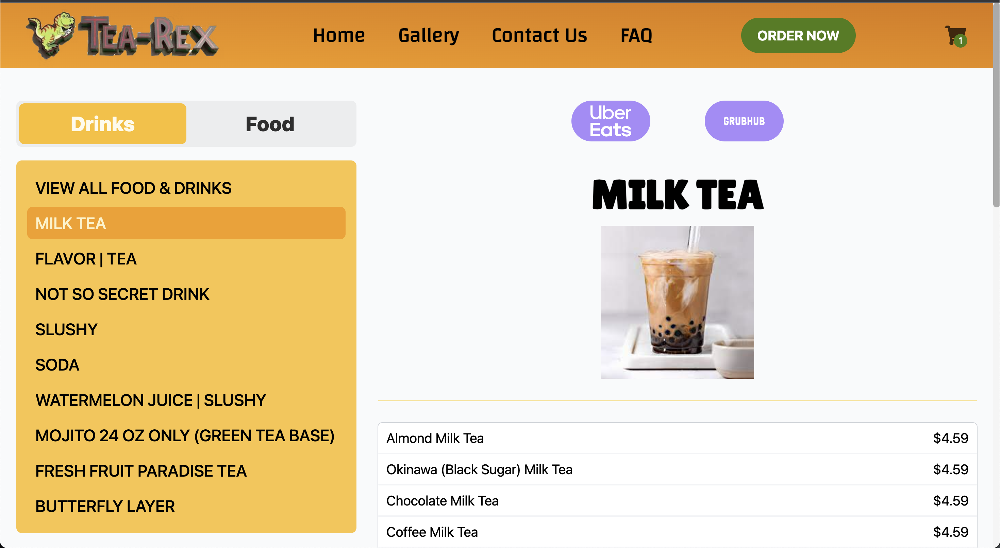
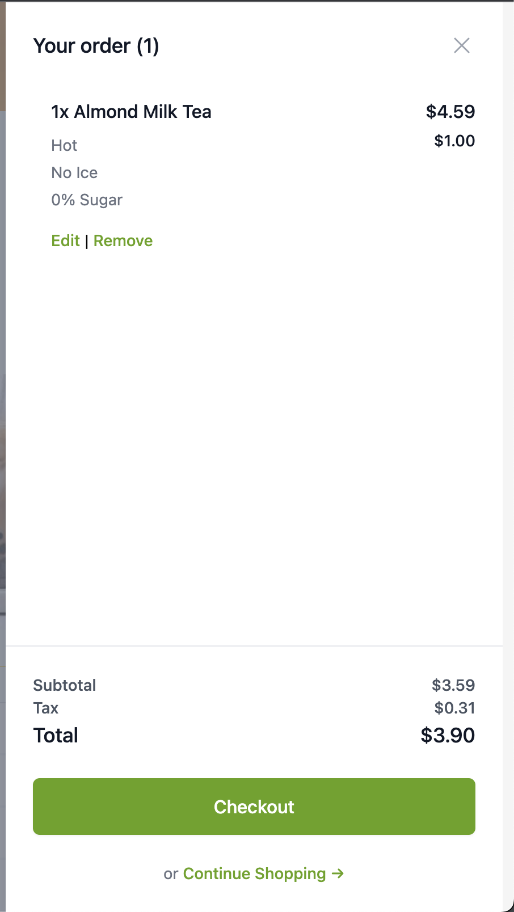
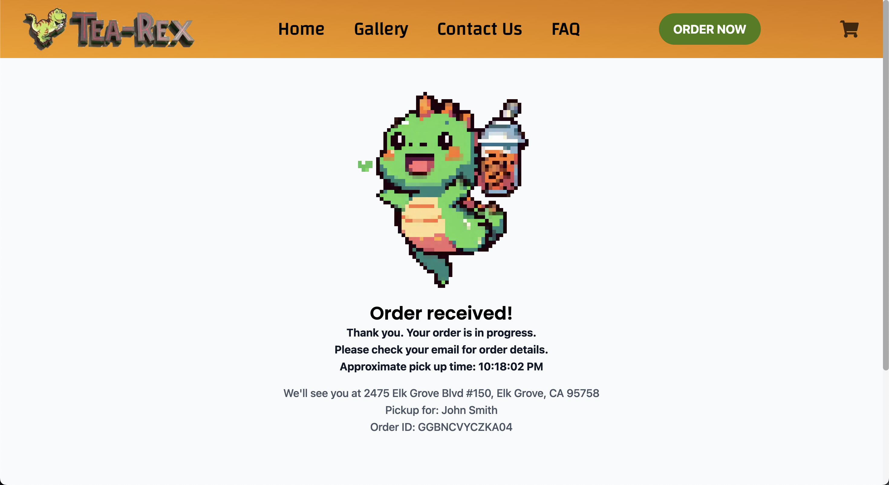

# **Tea-Rex | CSUS Senior Project**


## **Table of contents**

- [Synopsis](#synopsis)
- [Prototype](#prototype)
- [Completed Product](#completed-product)
- [Developer Instructions](#developer-instructions)
- [Testing](#testing)
- [Deploying To Production](#deploying-to-production)
- [Roadmap](#roadmap)
- [Contributors](#contributors)

## **Synopsis**
Gina Ko is requesting a website for her restaurant, Tea Rex. The website would contain all menu items, store contact information, location, and functionality to place orders online. Authorized employees of the establishment should be able
to make modifications to the menu items being displayed on the website through a login identification.

Features for this website include a rewards program for customers, a system that allows online orders to automatically be sent to the store for processing. An administration login is also requested to allow employees, managers, and Gina Ko to access the website if any changes are needed after the fact.

The administration page would include tools to change menu prices, add menu items, add pictures, change opening and closing times, access customer rewards information, allow messages to be inputted to send text messages to users signed up with the rewards system, and an inventory management system.

## **Prototype**

Before creating the website, we needed to come up with a proper mock-up in order to get a better understanding of the work to be done.

[Tea-Rex Current Website Prototype](https://tea-rex.vercel.app/)

### Application Flow

Everything starts at the home page. From there, you can branch off into the various different website sections: rewards, gallery, contact us, order now, and admin pages. The website is interconnected via the nav bar so users can skip to whatever sections interest them or they can go back to the home page if need be. The admin page is inaccesible to customers.


### Figma

We decided to use Figma for our mock-up as there were many useful design tools present. Our home page design had a nav bar that was fully functional, some pictures of the interior design, top 10 menu items, a map showing the restaurants location, and a footer containing important business information.


## **Completed Product**

The home page includes information such as an "about us" info about the restaurant, a map of where the restaurant is located, pictures of inside the restaurant, as well as pictures of the food/drinks.


The menu page has a sidebar to filter by food and drinks, as well as filtering specific sections, such as "Milk Tea", "Slushy", "Snacks", etc. The user can also view an image of the section on the right. They can also click on the menu item below to add the item to the cart pending customizations.



The shopping cart allows the user to view all the items in the cart, a price breakdown, a rewards system, and payment.



Once the user places the order they will be greeted with a order confirmation screen giving them the information they need to pick up the order.



## **Developer Instructions**

In development, the front and backend are served and managed seperately.

### **Frontend**

To install the frontend dependencies, from the root directory, run:
```sh
cd frontend
npm i
```

After installing dependencies, copy the `frontend/.env.example` file to `frontend/.env` and fill in the environmental variables in `frontend/.env`

- Leave `VITE_API_URL` empty to default the API url to `http://localhost:5000`

### Backend

To install the backend dependencies, from the root directory, run:

```sh
cd backend
npm i
```

Similar to before, copy the `backend/.env.example` file to `backend/.env` and fill in the environmental variables to `backend/.env`

`DATABASE_URL` is required, as it will connect the MySQL database to the Prisma ORM

`PORT` is optional. Leaving PORT empty will set the API port to 5000.

In order to setup prisma, within the backend directory run `npx prisma generate`

This will generate the prisma client.

## **Testing**

All tests are contained in `frontend/src/__tests__/`

These tests are built using [vitest](https://vitest.dev/), a next generation testing framework built to work seamlessly with vite.

To run the test script, while in the `frontend` directory run:

```
npm run test
```

Afterwards you should see something similar to below:

```javascript
 ✓ src/__tests__/RewardsSystemForm.test.tsx (5)
 ✓ src/__tests__/AddItemForm.test.tsx (2)
 ✓ src/__tests__/PaymentSystemForm.test.tsx (1)
 ✓ src/__tests__/Printer.test.tsx (1) 345ms
 ✓ src/__tests__/Navbar.test.tsx (1)
 ✓ src/__tests__/FAQ.test.tsx (1)

 Test Files  6 passed (6)
      Tests  11 passed (11)
   Start at  21:32:25
   Duration  2.33s (transform 313ms, setup 478ms, collect 3.51s, tests 742ms, environment 1.78s, prepare 295ms)


 PASS  Waiting for file changes...
       press h to show help, press q to quit
```

Note: The exact results may differ depending on current state of tests.

## **Deploying to Production**

To deploy to production, the exact methods may differ depending on what service is used to deploy. In most cases, this can be done with something like AWS App Runner to deploy the backend and AWS Amplify to deploy the frontend. The backend and frontend must be deployed seperately, either through different domains or ports.

No matter what service is used to deploy the app, the main configuration needed are the environment variables.

For the frontend, the following are specific environment variables to link to the backend:

- VITE_API_URL
 - This *must* be the url of the backend e.g. https://tea-rex-backend.com
 - Note: It is crucial that there is no leading slash at the end.
- VITE_TURNSTILE_SITE_KEY
 - This is a key given by [Turnstile](https://developers.cloudflare.com/turnstile/). This is unique to each turnstile app.
- VITE_STRIPE_PUBLIC_KEY
 - This is a key given by [Stripe](https://stripe.com/docs/api). This is unique to each Stripe app.
- VITE_CLOVER_MERCHANT_ID
 - This is a key given by [Clover](https://docs.clover.com/reference/api-reference-overview). This is unique to each clover app.
- VITE_CLOVER_PRINTER_API_TOKEN
 - Same as above.

For the backend, the following ar especific environment variables to link to the frontend:

- CLOUDINARY_API_KEY, CLOUDINARY_API_SECRET, CLOUDINARY_CLOUD_NAME
 - These are keys given by [Cloudinary](https://cloudinary.com/). This is unique to each cloudinary app.
- EMAIL_PASSWORD, EMAIL_USERNAME
 - These are the email information for sending order confirmations. Ideally this is a noreply email.
- ORIGIN_URL
 - This is the URL of the frontend application.
- RETURN_URL
 - This is the URL of the frontend application + "/payment-result"
  - For example: `www.frontend.com/payment-result`
- SECURE
 - This must be set to true in production to allow for https communication.
- STRIPE_SECRET_KEY
 - This is a key given by [Stripe](https://stripe.com/docs/api). This is unique to each Stripe app.

## **Roadmap**


- Sprint 3 (2023/03/26 - 2023/04/09)
  - [X] Add a navigation bar
  - [X] Add the home, rewards page, and footer section
- Sprint 4 (2023/04/10 - 2023/04/24)
  - [X] Implement Sidebar and Modal for Adding items to cart
  - [X] Add an administration page
  - [X] Implement image carousel on Home Page
  - [X] Implement map Functionality
  - [X] Implement shopping cart page and button on navigation bar
  - [X] Implement query on backend for items on menu page
- Sprint 5 (2023/08/28 - 2023/09/17)
  - [X] Implementation of menu editing
  - [X] Implementation of the Stripe API
  - [X] Redesign of the cart
- Sprint 6 (2023/09/20 - 2023/09/30)
  - [X] Redesign of the admin page
  - [X] Redesign of the home page
  - [X] Redesign of the menu page
  - [X] Implementation of a rewards system
  - [X] Cart bug fixes
- Sprint 7 (2023/10/02 - 2023/10/16)
  - [X] Redesign of the cart UI
  - [X] Add a 404 page
  - [X] Redesign of the loading page
  - [X] Small tweaks to general UI of the website
- Sprint 8 (2023/10/18 - 2023/10/29)
  - [X] Add a FAQ page
  - [X] Add UI/UX for the ordering process
  - [X] Create email form for the contact us page
  - [X] Allow editing of the photos
- Sprint 9 (2023/11/01 - 2023/11/12)
  - [X] Tweaks to the rewards system
  - [X] General tweaks for website responsiveness on mobile platforms
  - [X] Create an employee management page
  - [X] Add Cloudflare Turnstile to email form on contact us page
  - [X] Finishing touches


## **Contributors**

  - Khanh Truong - khanhtruong2@csus.edu
  - Kadien Tran - kadientran@csus.edu
  - Manvir Mann - manvirmann@csus.edu
  - Matthew Dela Cruz - matthewdelacruz@csus.edu
  - Siran Guo - siranguo@csus.edu
  - Thanh Le - thanhquangle@csus.edu
  - Timothy Chiang - tchiang@csus.edu
  - Trevor Streng - trevorstreng@csus.edu
  
