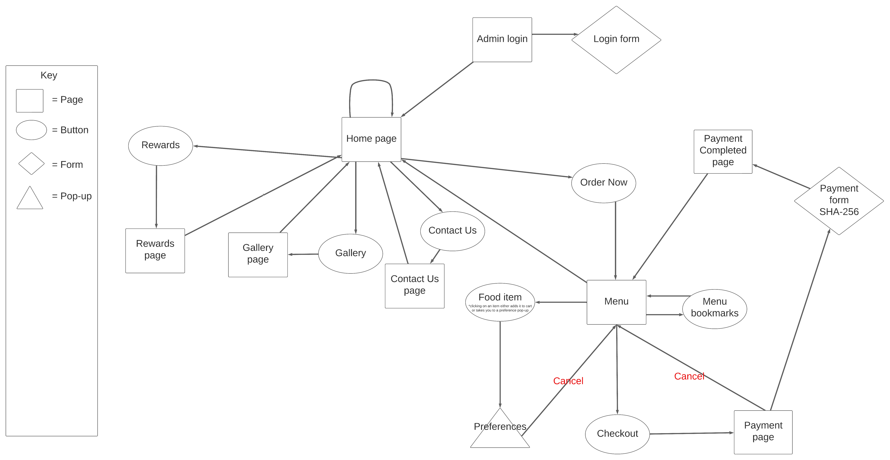
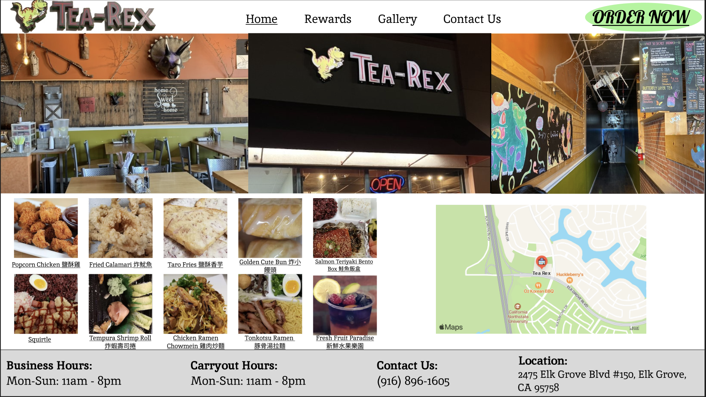
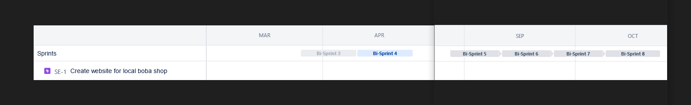

# **Tea-Rex | CSUS Senior Project**


## **Table of contents**

- [Synopsis](#synopsis)
- [Prototype](#prototype)
- [Developer Instructions](#developer-instructions)
- [Testing](#testing)
- [Deploying To Production](#deploying-to-production)
- [Roadmap](#roadmap)

## **Synopsis**
Gina Ko is requesting a website for her restaurant, Tea Rex. The website would contain all menu items, store contact information, location, and functionality to place orders online. Authorized employees of the establishment should be able
to make modifications to the menu items being displayed on the website through a login identification. 

Features for this website include a rewards program for customers, a system that allows online orders to automatically be sent to the store for processing. An administration login is also requested to allow employees, managers, and Gina Ko to access the website if any changes are needed after the fact. 

The administration page would include tools to change menu prices, add menu items, add pictures, change opening and closing times, access customer rewards information, allow messages to be inputted to send text messages to users signed up with the rewards system, and an inventory management system.

## **Prototype**

Before creating the website, we needed to come up with a proper mock-up in order to get a better understanding of the work to be done. 

[Tea-Rex Current Website Prototype](https://tea-rex.vercel.app/)

### Application Flow 

Everything starts at the home page. From there, you can branch off into the various different website sections: rewards, gallery, contact us, order now, and admin pages. The website is interconnected via the nav bar so users can skip to whatever sections interest them or they can go back to the home page if need be. The admin page is inaccesible to customers. 
 


### Figma 

We decided to use Figma for our mock-up as there were many useful design tools present. Our home page design had a nav bar that was fully functional, some pictures of the interior design, top 10 menu items, a map showing the restaurants location, and a footer containing important business information. 



## **Developer Instructions**

In development, the front and backend are served and managed seperately.

### **Frontend**

To install the frontend dependencies, from the root directory, run:
```sh
cd frontend
npm i
```

After installing dependencies, copy the `frontend/.env.example` file to `frontend/.env` and fill in the environmental variables in `frontend/.env`

- Leave `VITE_API_URL` empty to default the API url to `http://localhost:5000`

### Backend

To install the backend dependencies, from the root directory, run:

```sh
cd backend
npm i
```

Similar to before, copy the `backend/.env.example` file to `backend/.env` and fill in the environmental variables to `backend/.env`

`DATABASE_URL` is required, as it will connect the MySQL database to the Prisma ORM

`PORT` is optional. Leaving PORT empty will set the API port to 5000.

In order to setup prisma, within the backend directory run `npx prisma generate`

This will generate the prisma client. 

## **Testing**
We will be testing next semester in CSC 191.
## **Deploying to Production**
We will be deploying to production next semester in CSC 191.

## **Roadmap**



- Spring 3 (2023/03/26) - 2023/04/09)
  - [X] Navbar
  - [X] Home and Rewards page, Footer
- Sprint 4 (2023/04/10 - 2023/04/24)
  - [X] Implement Sidebar and Modal for Adding items to cart
  - [X] Implement Image carousel on Home Page
  - [X] Implement Map Functionality
  - [X] Implement Shopping Cart Page and button on Navigation bar
  - [X] Implement query on backend for items on menu page
- Sprint 5 (2023/08/28 - 2023/09/11)
  - [ ] Implement Adding items to cart
  - [ ] Contact Us Page
- Sprint 6 (2023/09/11 - 2023/09/25)
  - [ ] Implement Admin Login/Functionality
- Sprint 7 (2023/09/25 - 2023/10/09)
  - [ ] Implement Rewards System in Database
- Sprint 8 (2023/10/09 - 2023/10/23)
  - [ ] Implement a type of inventory management system for admin
  - [ ] Send orders to restaurant
  
